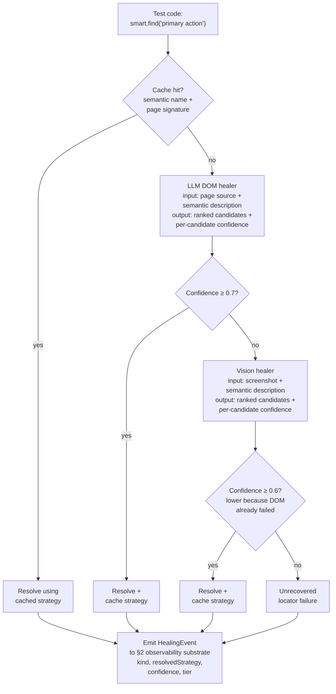

# An Agent Harness for Mobile Test Automation

**Author:** Suneet Malhotra
ORCID: <INSERT_ORCID_BEFORE_SUBMISSION>
**Affiliation:** Senior Manager, Test Engineering, Motorola Solutions

> *First-page footnote.* The reference implementation and the empirical evaluation in §6 were developed by the author independently of any employer, using only public infrastructure and a public React Native demo encoded in the companion repository. The practitioner observations in §1 are drawn from the author's professional experience and have been abstracted to remove any employer-specific or proprietary details; they are presented as motivational context, not as measured data from any specific employer deployment, and no employer-internal systems, products, code, or data are described.

**Target venue:** IEEE Software (Practice column). Backup venue: AIware 2026 Industry/Experience track.
**Contact:** suneet@suneetmalhotra.com · https://suneetmalhotra.com
**ORCID:** *[author action item — `TODO(submission-block)`: register at orcid.org and substitute the 16-digit identifier before submission. Both IEEE and AIware require an ORCID.]*
**Companion code:** https://github.com/SuneetMalhotra/agent-harness. A versioned arXiv preprint will be posted at submission time: `TODO(arXiv)`.
**Figures:** Figures 1 and 2 are specified in `04_Figures_Spec.md` and rendered separately for the submission package. `TODO(figures)`: attach rendered PNG/PDF assets at submission time; the body references them by number.

---

## Abstract

Mobile test automation with LLM-based agents spans three partially connected layers — agent-drafted frameworks, multi-agent SDLC pipelines, and self-healing execution on heterogeneous hardware — that existing systems treat in isolation. This article describes an *agent harness*: a coupling pattern that keeps the three layers separate but connects them through a shared observability substrate (a schema-defined event store with a query API, not a coordination layer). In the reference implementation, a coding agent authors a TypeScript framework under human review, a five-agent pipeline (PM, QA, Automation Engineer, Developer, PR Reviewer) handles design-to-test over the Model Context Protocol, and a three-tier execution plane combines a physical device bench, a commercial cloud device farm, and ephemeral virtual back-end hardware. A proof-of-concept walkthrough on a small public React Native demo validates the architecture end-to-end: the stub pipeline completes in sub-second wall clock, all 12 healing events dispatch to their tagged tiers, and a pixel-comparison baseline flags 6/12 functional defects (the only independently grounded number in §6). Healing-cascade and visual-assertion *effectiveness* are deferred to a live-hardware multi-application study and a human-rated audit (`audit/protocol.md`); the §6 numbers report what was observed under stub providers, not measured rates against ground truth. The contribution is the cross-layer coupling. Reference implementation: https://github.com/SuneetMalhotra/agent-harness.

---

## 1. Introduction

In production engineering practice, mobile test automation is rarely a single-layer concern: a framework has to be authored, operated, and executed; tests must run on a mix of simulators, cloud devices, and physical benches; and the whole must integrate with CI, defect tracking, test management, and design tooling. The question has shifted from "can an agent contribute to a layer?" to "what changes when the layers couple?" Three failure modes recur when the layers run in isolation: framework refactors against hand-curated priorities rather than execution data; pipelines write tests against routing tags that go stale; execution layers collect observability data nobody reads.

The 2023–2026 literature breaks into three largely independent lanes. Self-healing locators have an open-source antecedent in Healenium [16], which uses tree-edit distance over rendered DOM trees. LLM-guided mobile GUI exploration has its strongest published instance in GPTDroid [17], reporting approximately 32 percent activity-coverage improvement and 31 percent more bugs on 93 Google Play apps; AutoDroid [19] and AppAgent [20] extend the LLM-driven mobile-agent line to general task automation, and LELANTE [18] couples LLM-driven action selection with an Android execution pipeline. Each treats one execution-layer concern; none couples to a multi-agent pipeline or to framework authoring. Multi-agent SDLC pipelines have a closely related antecedent in MetaGPT [23], which decomposes software development across PM, Engineer, QA, and Reviewer communicating through structured artifacts in shared in-memory state; §2 and §4 detail how the substrate, execution-tier integration, and cross-layer telemetry feedback differ. Hou et al. [3] identify tool integration and end-to-end traceability as recurring gaps in LLM-for-SE deployments; the substrate described here is one concrete answer. Fan and Harman [4] frame the open problem set around hallucination, evaluation, and the lack of grounded execution feedback.

This article describes a coupling pattern I call an *agent harness*. The term has recent independent lineage: Meng et al. [15] formalize the harness as a labeled-transition-system wrapping a single agent's execution loop. The term as used here is a domain-specific instantiation applying the same surfacing principle one level up: a *cross-layer* coupling across three agent-augmented layers that share an observability substrate. Framework refactoring is driven by per-test latency and healing-rate data from execution; pipeline routing decisions are driven by per-tier flake rates. Each layer remains testable in isolation; the coupling is a thin data substrate, not a new monolith. §2.1 provides a worked instantiation in which the QA agent receives a structured healing digest from the previous run and produces a coverage recommendation the authoring agent can act on.

The contribution is the coupling. Against [15], scope (three-layer SDLC, not single-agent infrastructure). Against MetaGPT [23], substrate (artifact-mediated MCP handoffs with execution telemetry feedback, not shared in-memory state). Against GPTDroid [17], AutoDroid [19], AppAgent [20], LELANTE [18], level (framework-level authoring plus multi-tier execution, not exploration-driven GUI testing). Against Healenium [16], method (cache-primary, LLM-DOM-healer secondary, vision-fallback tertiary). Against the surveyed multi-agent SE literature: HPCAgentTester [7] generates HPC unit tests via a Recipe/Test-Agent critique loop but addresses no execution-tier heterogeneity; ALMAS [8] is an agile-role pipeline operating on a single execution context with no cross-tier routing substrate; Chia et al. [9] catalogue pipeline contributions but do not enumerate cross-layer observability as a category. The remainder describes the pattern (§2), authoring (§3), operating (§4), execution (§5), evaluation (§6), and adoption (§7).

---

## 2. The agent harness pattern

The harness has three layers and one data substrate.

**Authoring layer.** An LLM coding assistant (the reference implementation uses a hosted-model CLI; the architecture is provider-agnostic, with open-weights local-model backends such as Ollama-served Llama-family models supported equally — consistent with open-weights LLM-based testing work in [24]) drafts changes under human review. The prompting style follows the chain-of-thought tradition [5]; the workflow follows the coding-agent adoption literature [12].

**Operating layer.** A five-agent SDLC pipeline: Product Manager, QA Engineer, Automation Engineer, Developer (optional), Pull Request Reviewer. Agents share no state directly; each writes its output to an external artifact system that the next reads as input, with contracts tuned to SDLC artifacts (PRDs, test plans, code, review comments). The artifact-mediated handoff echoes multi-agent pipelines in adjacent domains such as automated penetration testing [6]. The handoff substrate is the Model Context Protocol [11]. The role decomposition is isomorphic to MetaGPT [23]; the substrate is not. MetaGPT communicates through shared in-memory state inside one process; this pipeline writes typed artifacts across MCP server boundaries (filesystem, Git, Jira, Confluence).

**Execution layer.** Three hardware tiers. Tier 1: a physical device bench for real BLE peripherals, cellular behavior, and hardware-level sensor state. Tier 2: a commercial cloud real-device farm for cross-OS and cross-form-factor coverage. Tier 3: ephemeral virtual hardware emulating back-end peripherals for end-to-end paths. An intelligence layer sits between test code and hardware: cached semantic locators, an LLM healer on cache miss, a vision fallback when DOM healing fails, and a multimodal visual assertion service.

**The observability substrate.** All three layers emit into a shared store. The canonical schema is in `types.ts`; load-bearing types are `ObservabilityEntry`, `HealingEvent`, `AssertionEvent`, and `AgentHandoff`, each keyed to a test case, commit, and agent. A thin query API exposes per-test and per-suite aggregates to prompts as structured tables. These keys let the QA and authoring agents change behavior in response to execution data.

What distinguishes this from three integrated systems is that each layer's prioritization decisions are *designed to be conditioned on* observability events emitted by the other layers, not on authoring-time guesses. Whether agents act differently with vs. without the substrate is a design objective of this work; demonstrating that effect empirically requires comparative runs that are deferred to future work alongside the live-hardware audit (§7.3). Where Meng et al. [15] propose the agent harness as a wrapping LTS around *one* agent, this pattern exposes a *shared* event stream across three agent-augmented layers.

### 2.1 An intended usage scenario

The following is a designed scenario showing what the substrate is for; the §6 walkthrough confirms the digest is queryable from agent prompts, but does not demonstrate that the QA agent's output is *different* with vs. without the digest. The reference run produced 12 `executing.healing` events: 11 resolved from cache, 1 from `dom-healer` (test case `TC-06`, Tier 2). In the intended usage, the QA Engineer agent's coverage-prioritization prompt is fed a digest filtered to `kind=healing` and grouped by `resolvedStrategy`: *"11/12 cache, 1/12 dom-healer on TC-06 (tier2). Per-strategy fail rate: 0/12. Recommend prioritizing new coverage on locator-stable surfaces; flag TC-06 for re-cache after the next framework refactor."* The QA agent's next-coverage output preserves the recommendation as a structured field in the test-case ticket; the Authoring agent, when next asked to refactor the resolver, receives the same digest. The substrate carries the digest; the open question of whether agents reliably act on it under varying digest content is a §7.3 follow-up.

Figure 1 shows the three layers and substrate.

---

## 3. The authoring layer

The framework's TypeScript codebase was developed over roughly five months with substantial LLM coding-assistant support: an engineer writes a prompt, the assistant proposes a diff, the engineer reviews and merges. The assistant is invoked via a provider-flexible CLI wrapper (the reference implementation supports a hosted-model OAuth path and a local-weight path through Ollama, similar to the open-weights LLM-testing approach demonstrated in [24] at `https://github.com/Shaheer-Rehan/Llama-2-for-Software-Testing`); the architectural pattern does not depend on which model backend is chosen. Practitioner observations from a single deployment; counter-evidence on LLM coding limits [14] and longitudinal Copilot studies [12] suggest the velocity direction is plausible but the magnitude does not generalize.

**Practitioner observation (not an empirical result).** Five agent-assisted framework modules had prompt-to-merge wall-clock times of approximately 1.5, 2.0, 2.5, 3.0, and 4.5 hours; three hand-authored modules had approximately 6, 8, and 11 hours. With N=5 and N=3 on a single workstation, these are anecdotal observations, not a powered speedup estimate. Consistent with [14], the slowest agent-assisted modules involved complex concurrency or hardware-interaction logic. Reported here rather than in §6 because the sample carries no inferential weight.

### 3.1 Provenance

The provenance discipline the framework adopts is conceptual: a commit-message convention identifying authorship class (LLM-drafted, LLM-drafted-then-revised, or human-authored) and a pull-request convention linking to the prompt and reasoning trace when exposed. At any line, an engineer can in principle answer "who wrote this, from what prompt?" with a defined chain of evidence. The discipline is necessary because, without it, the path from a wrong line back to the prompt that produced it is not recoverable; it is independent of which model backend is in use.

### 3.2 The reflexive-correctness question

This is the most under-explored open problem this paper surfaces, and it is named here as a sub-contribution. An LLM-assisted framework used to test product code raises a specific question: how is the framework itself known to correctly test the product? The conventional answer ("tests test the framework") is circular when the tests are also LLM-drafted. The reflexive-correctness problem is the test oracle problem [21] in a new form: an oracle whose generation process is itself the property under test.

The answer here is *layered validation* — the harness does not formally close the loop, but it makes correctness *auditable* through three independent oracle sources, each operating on a layer the LLM cannot reflexively validate:

- **Hand-authored unit tests on framework library code,** outside the LLM-assisted authoring pipeline. These tests are intentionally not regenerated when the library is refactored; they pin behavioral invariants the assistant might otherwise drift past. Connects to the structural testing of LLM agents in [2].
- **Tier-1 hardware ground truth on product-level tests.** When a test on a physical device observes a hardware-level outcome the simulator-only path cannot fake (a BLE characteristic value, a sensor reading), that observation is a non-LLM oracle independent of both the framework and the product LLM-generation chain.
- **A Pull Request Reviewer agent (§4) as a final structured-rubric gate,** with explicit rubric items that it (a) is a different LLM call than the one that authored the change, and (b) must justify its disposition with citations to the diff, not the prompt that produced the diff.

The framing as a named sub-contribution matters because the LLM-for-SE literature [3, 4] treats agent-authored testing as a generation problem (better tests, more coverage) and rarely confronts the reflexive correctness of the agent-authored testing infrastructure itself; the layered-validation approach is one concrete answer, and the open problem of *formal* reflexive correctness (a closed-loop guarantee that an LLM-assisted framework is sound on the property it tests) is identified as future work for the LLM-for-SE community.

---

## 4. The operating layer: a five-agent SDLC pipeline

Each agent is a Markdown specification (a "skill" or "agent prompt") plus access to a defined set of MCP servers. The Product Manager turns a design artifact or stakeholder description into a PRD and acceptance criteria (the elicitation prompt draws on [13]). The QA Engineer turns a PRD into a test specification with traceability links. The Automation Engineer turns test cases into WebDriverIO test files and a pull request. The Developer (optional) implements feature code. The Pull Request Reviewer emits a structured review with a disposition (approve, request changes, block). Agent specifications and I/O contracts live in `agents/`. The role decomposition is isomorphic to MetaGPT [23]; the substrate is artifact-mediated MCP handoffs rather than shared global memory. Whether the MCP-substrate architecture actually produces *different agent outputs* than MetaGPT's shared-memory configuration when execution-tier telemetry routes back into the authoring layer is the load-bearing comparative claim this paper does *not* yet demonstrate empirically; the substrate is designed to enable that routing, but A/B'ing it against a shared-memory baseline is future work (§7.3). The pipeline runs end-to-end or step-by-step; end-to-end handles low-complexity features, step-by-step when intermediate review is valuable.

MCP [11] replaces per-tool custom adapters with a typed interface per server. Each agent's output carries a structured trailer recording agent identifier, model version, prompt, input artifact IDs, and timestamp. The path from a downstream defect back through test code, test case, PRD, and design artifact is queryable; I call this *inter-agent provenance*, distinct from the intra-agent provenance of §3.1.

The stub-provider end-to-end run completes in sub-second wall clock — confirmation that the five agents hand off cleanly over MCP, not a measurement of live-LLM pipeline latency (§6 expands on this distinction). Step-by-step runs with the live-LLM path range from minutes (small features) to several hours (cross-functional features with multiple revision cycles). In the author's prior experience across several engineering contexts, comparable hand-authored scenarios took multiple working days; a practitioner recollection, not a measured distribution. A defensible economic comparison would include the cost of the agent infrastructure, which is out of scope (§7.2). The dominant failure mode was upstream specification gaps (acceptance criteria left implicit at the PRD stage) rather than agent-internal errors; the elicitation work in [1] addresses this gap directly. Figure 2 shows the pipeline and MCP servers.

### 4.1 LLM provider backends

Each agent calls the same `ModelProvider` interface (`generate(system, user, responseFormat, temperature) → Promise<string>`). The harness ships an adapter for five backends; three are live and exercised end-to-end, two (OpenAI, Gemini) are interface stubs whose `generate()` methods throw on invocation, awaiting an HTTPS implementation against the documented contract. Backend selection is a single CLI flag (`--provider <name>`).

| Backend | Status | Endpoint | Weights | Default model | Credential | Use case |
|---|---|---|---|---:|---|---|
| `stub` | **live** | in-process | n/a | n/a | none | Deterministic offline reproduction; CI; demos without network |
| `anthropic` | **live** | `claude -p` subprocess (OAuth) | hosted | `claude-sonnet-4-6` | Claude OAuth session | Reference live-LLM path used in §6 walkthrough |
| `ollama` | **live** | `http://localhost:11434/api/chat` | **open** (local) | `llama3.2` | none | Open-weights replication; air-gapped deployment; fine-tuned variants |
| `openai` | stub (throws) | Chat Completions API | hosted | `gpt-4.1` | `OPENAI_API_KEY` | Cross-model replication once HTTPS implementation lands (§7.2) |
| `gemini` | stub (throws) | Generative Language API | hosted | `gemini-2.5-pro` | `GOOGLE_API_KEY` | Cross-model replication once HTTPS implementation lands (§7.2) |

The `ollama` adapter routes the five agents through a locally running [Ollama](https://ollama.com) server and accepts any model Ollama can serve. It is the open-weights complement to the live hosted path (`anthropic`) and follows the open-weights LLM-testing pattern that Rehan et al. [24] demonstrated for fine-tuned Llama-2-7b on focal-method-to-test-case generation (`https://github.com/Shaheer-Rehan/Llama-2-for-Software-Testing`). The relevant adoption tradeoffs: hosted providers have stronger calibration and reasoning depth at per-call cost and outbound data transfer; the local-weights path eliminates both at the cost of fine-tuning effort or larger-model latency. Because the §2 observability substrate is keyed on the agent identifier and the model version rather than on the provider, swapping live backends does not invalidate the coupling — a §7.2 study comparing `anthropic` against `ollama` already runs end-to-end against the substrate; extending that comparison to OpenAI and Gemini requires the two stub adapters to be filled in against their documented HTTPS contracts first.

---

## 5. The execution layer: three hardware tiers

### 5.1 Tiers and routing

Tier 1 is a physical device bench, the only tier that exercises tests requiring real BLE peripherals, cellular radio, biometric sensors, or hardware state inaccessible from emulators; the reference deployment uses Android devices connected over USB to a remote Linux server, each addressable via ADB. Tier 2 is a commercial cloud real-device farm driven through an Appium-compatible interface. Tier 3 is ephemeral virtual hardware emulating back-end peripherals for end-to-end paths (the mobile app still runs on Tier 1 or Tier 2). Tiers 2 and 3 are conventional in the cloud-testing literature. Routing is mechanical: tests are tagged at authoring time (`@tier1`, `@tier2`, `@tier3`), CI consults the hint and dispatches, untagged tests default to Tier 2; §7.3 returns to whether adaptive routing should be the long-term answer.

### 5.2 The intelligence layer

Test code does not call hardware directly. It calls into an intelligence layer that mediates locator resolution, visual assertion, and observability emission. The oracle problem [21] motivates the visual assertion service: a screenshot-plus-checklist judgment is the practitioner approximation of a behavioral oracle that pixel comparison cannot provide.

**Self-healing locators.** Test code refers to elements semantically: `smart.find("primary action button on main screen")`. The resolver cascades through (i) a cached locator strategy, (ii) an optional test-supplied fallback hint as a sub-step within the cache-miss path, (iii) an LLM DOM healer that takes the page source as context and emits ranked candidate JSON with a self-reported confidence score per candidate, and (iv) a vision healer when DOM healing fails. In `intelligence.ts` the DOM-healer accept threshold is `confidence >= 0.7` and the vision-healer threshold is `confidence >= 0.6`. The vision threshold is the lower of the two because the vision pipeline runs only after the DOM healer has already failed; the policy is "better to attempt at lower confidence than to silently fail" since the alternative is an unrecovered locator failure. Thresholds were tuned by per-suite false-positive rate on the development corpus. Successful strategies are cached. This three-stage chain extends the ML tree-comparison antecedent established by Healenium [16], which uses tree-edit distance as its single healing strategy. The full dispatch is shown in Figure 3.

**Fig. 3.** Self-healing locator cascade implemented in `intelligence.ts`. Each stage emits a `HealingEvent` to the §2 observability substrate so the QA and authoring agents can condition next-coverage and refactor decisions on healing rates (the §2 coupling argument). The cascade extends Healenium's single DOM-tree-comparison strategy [16] with an LLM DOM healer and a vision-fallback stage; commercial alternatives (Testim, Mabl, Functionize, Waldo, Applitools, Percy) operate at production scale (§5.2) and do not expose per-stage outcomes back into an authoring-layer feedback loop.

**Vision-based fallback.** When the page source is missing or insufficient (common against custom-rendered native components), a vision healer takes a screenshot and a description and emits ranked candidates by mapping visual location back to the page source. The framework invokes it only when DOM healing has failed.

**Visual assertion.** A separate service takes a screenshot, an expected-behavior description, and a checklist of critical properties, and asserts semantic match. Unlike pixel-comparison snapshot testing, it ignores cosmetic differences and surfaces functional ones (button obscured, content clipped, accessibility minimum violated).

All three tiers emit into the §2 substrate.

**Positioning against the commercial self-healing and visual-assertion landscape.** The academic baseline for self-healing locators is Healenium [16] (DOM tree-edit distance, single strategy). The production-scale commercial baselines — Testim, Mabl, Functionize, Waldo for self-healing; Applitools and Percy for visual assertion — operate on N ≫ 10⁶ test executions and have multi-organization deployment evidence. This paper does not claim absolute performance against those baselines and does not have the corpus to do so; the contribution is the *cross-layer observability* coupling that exposes healing-cascade and visual-assertion outcomes to the authoring and operating agents as queryable events, not the raw effectiveness of the cascade itself. Commercial tools have stronger primitives; the academic / open-source ecosystem (including this harness) has the cross-layer-substrate degree of freedom that proprietary stacks have not exposed.

---

## 6. Architecture validation and proof-of-concept walkthrough

This section reports what was observed when the harness was run end-to-end against deterministic stub providers for each of the three execution tiers. The framing distinction is load-bearing: the numbers here are *architecture confirmation* (the pipeline runs, agents hand off over MCP, the healing cascade dispatches in the order specified, the substrate accumulates events the prompts can query) rather than *empirical effectiveness measurement* (whether the healing cascade or visual-assertion service actually outperforms the alternatives on real applications at production scale). The latter requires live hardware across three to five applications and a human-rated audit; both are the priority §7.3 follow-up. The numbers in this section are not measurements of healing or visual-assertion *quality*.

The evaluation target is a small public React Native TodoMVC-style application. The PM agent generated a PRD, the QA agent 12 test cases, the Automation Engineer agent WebDriverIO test code. Output ships at `results.json` and reproduces on `npm install && npx tsx examples/run-example.ts`. Per-layer measurements follow the metrics taxonomy of Liu et al. [10].

**Pipeline runtime.** The stub-provider run completes the 12-case suite in sub-second wall clock (recorded as `results.json: pipelineRuntime.stubDurationSeconds`); this is architectural confirmation that all five agent handoffs over MCP execute end-to-end in one process, not a measurement of live-LLM pipeline latency. The live-LLM path runs in the single-digit-minutes range per case on commercial models at the time of writing, but no live-LLM runtime distribution is reported in this paper (deferred to the §7.2 live-hardware multi-application study).

**Healing-cascade dispatch (architectural confirmation).** The run produced 12 `executing.healing` events: 11 resolved from cache (11/12), 1 from the LLM DOM healer (1/12, TC-06, Tier 2); the vision-fallback path was not exercised because the DOM healer recovered the one cache-miss event on its first attempt. This confirms the cascade *dispatches in the order specified* (cache → DOM → vision); it does not measure healing *effectiveness* on real applications. The stub-provider configuration in `harness.ts` (the `usingStub` ternary at lines 209–216, with the four rates at lines 211–214) encodes cache 92%, DOM-healer conditional success 88% on cache-miss events, vision-fallback conditional success 79% on DOM-healer-fail events, and combined recovery 97%. These are stub design parameters that the run reproduces — not measurements of healing rates against ground truth.

**Visual assertions.** The visual-assertion corpus is the 24-image set in `harness.ts` as `VISUAL_CORPUS`: 12 author-curated functional defects and 12 author-curated cosmetic variations, with ground-truth labels assigned at corpus-design time before any model judgment. The independently grounded number here is the pixel-comparison baseline: a pixel-comparison snapshot tester flagged 6 of 12 functional defects (6/6 precision, 6/12 recall) and zero cosmetic changes; this is the only visual-assertion claim resting on independent ground truth. The harness's visual-assertion service emits per-image verdicts to the substrate, but per-image precision/recall counts are **model-reported, not human-validated**: the same model that produced the assertions classifies its own outputs. They are therefore deferred to post-audit reporting under the protocol in `audit/protocol.md` and rater instructions in `audit/rater_instructions.md`.

**Tier routing.** All 12 test cases dispatched to their tagged tier on first invocation. This confirms the routing *mechanism* works; it does not confirm correctness of the *tagging decisions*, only that the dispatch path is wired correctly (the same engineer wrote tags and tests).

### 6.1 Threats to validity

**Single-application scale.** One small React Native demo, smaller than typical production mobile apps. Authoring velocity, healing rates, and routing behavior are sensitive to application complexity, team size, and engineering culture. A three-to-five-application study is the most important next experiment.

**Reflexive correctness, same-model judge.** Per §3.2, the correctness argument is empirical, not formal. An agent-authored framework may have systematic blind spots not surfaced by same-model testing; the healing numbers come from the framework's own intelligence layer (here, from the stub providers in `harness.ts`), and the visual-assertion service emits judgments that have not been independently rated. The companion repository ships an audit protocol and rater instructions for a human spot-audit; human-rated rates are required before the §6 visual-assertion numbers can be cited as validation-scale evidence. A multi-model judge ensemble is a partial mitigation.

**Cost asymmetry.** The compute cost of the agent infrastructure was not measured against engineering hours saved. Economics is the subject of separate work and explicitly out of scope.

**Statistical power.** The authoring-velocity (N=5 / N=3), visual-assertion (N=24), and healing (N=12, 1 cache miss) samples are all small. No percentage point carries inferential weight individually; the configured stub-provider rates are design parameters, not measurements; the table is reproducible, not statistically conclusive.

---

## 7. Scope, limitations, and adoption

### 7.1 Fit

The pattern fits mobile application testing with multi-tier hardware requirements (BLE/sensor, cross-platform, end-to-end), teams with coding-agent tooling willing to adopt it at the framework-authoring level, and where provenance and cross-layer observability are first-class concerns. Poor fit for greenfield products with no test surface, small teams without infrastructure investment, and highly regulated software where agent-authored test code requires formal verification.

### 7.2 Open problems and future work

**Cost economics (out of scope).** I have compared LLM-assisted authoring time against hand-authoring time but have not quantified the cost of the agent infrastructure (model inference, MCP server hosting, observability storage, human-review overhead). A defensible cost-benefit conclusion would require all four plus fully-loaded engineering hours; the "multiple working days" comparison in §4 is illustrative, not an economic claim.

**Cross-tier routing.** Authoring-time tag-based routing works in this deployment but static tags grow stale; *adaptive tier routing* (the framework choosing tiers from observed flake rates and execution latency) is an open direction, with the flake-rate signal needing grounding in [22] before it can carry routing weight.

**Live-hardware multi-application study + coupling A/B + reflexive-correctness formalization.** Priority follow-ups: (a) live-hardware re-run of §6 across three to five applications; (b) prompt-level A/B of the QA agent's coverage-prioritization output with vs. without the §2 substrate digest, to demonstrate the coupling claim empirically rather than designedly; (c) MetaGPT shared-memory vs. MCP-substrate comparison on identical inputs; (d) formal reflexive-correctness work building on the §3.2 layered-validation approach.

### 7.3 Implications and reproducibility

Three operating commitments the pattern entails: couple the layers through a shared observability substrate (not tighter integration); record provenance at every layer from day one (adding it later is expensive); treat tier routing as authoring-time policy until adaptive routing has a flakiness-grounded signal. Reproducibility: the primary path is the offline stub provider via `npm install && npx tsx examples/run-example.ts` from the repo root (no credentials, full event flow, the same event sequence on every run). A secondary live path (`npx tsx harness.ts --provider <name>`) routes through a configurable LLM backend — hosted-model OAuth or a local-weight backend such as Ollama; live outputs are stable but not strictly deterministic at temperature 0 and will require a model substitution when versions deprecate. The `v1.0.0` release tag at `https://github.com/SuneetMalhotra/agent-harness` pins the exact code that produced the §6 numbers.

---

## Acknowledgments

The author thanks the open-source React Native and TodoMVC communities for the public reference designs and the practitioner community engaged at BrowserStack Breakpoint 2026 and BrowserStack World Tour 2025 for discussions that shaped this work.

---

## Author biography

Suneet Malhotra is Senior Manager, Test Engineering at Motorola Solutions, with over 20 years in consumer-scale mobile and web quality engineering. He holds an M.S. in Computer Science from the University of Southern California, Los Angeles. His research interests are AI-augmented test automation and software quality engineering; a companion preprint on LLM-driven specification enrichment for design-to-test pipelines is at [1]. More at suneetmalhotra.com.

---

## References

[1] S. Malhotra, "Specification Enrichment: Using LLMs to Surface Implicit Constraints in Design-to-Test Pipelines," preprint, 2026. Companion code: https://github.com/SuneetMalhotra/specification-enrichment.

[2] J. Kohl, O. Kruse, Y. Mostafa, and A. Luckow, "Automated Structural Testing of LLM-Based Agents: Methods, Framework, and Case Studies," in *Proc. 2025 IEEE Int. Conf. Big Data*, 2025, doi: 10.1109/bigdata66926.2025.11401679.

[3] X. Hou et al., "Large Language Models for Software Engineering: A Systematic Literature Review," *ACM Trans. Softw. Eng. Methodol.*, 2024, doi: 10.1145/3695988.

[4] A. Fan, B. Gokkaya, M. Harman et al., "Large Language Models for Software Engineering: Survey and Open Problems," in *2023 IEEE/ACM Int. Conf. Software Eng.: Future of Softw. Eng. (ICSE-FoSE)*, 2023, pp. 31–53, doi: 10.1109/icse-fose59343.2023.00008.

[5] J. Wei et al., "Chain-of-Thought Prompting Elicits Reasoning in Large Language Models," in *Advances in Neural Information Processing Systems*, 2022, doi: 10.48550/arXiv.2201.11903.

[6] X. Shen, L. Wang, Z. Li, and Y. Chen, "PentestAgent: Incorporating LLM Agents to Automated Penetration Testing," in *Proc. 20th ACM ASIA CCS*, Aug. 2025, doi: 10.1145/3708821.3733882.

[7] T. Hao et al., "HPCAgentTester: A Multi-Agent LLM Approach for Enhanced HPC Unit Test Generation," in *2025 IEEE/ACM Int. Conf. AI-powered Softw. (AIware)*, Nov. 2025, doi: 10.1109/aiware69974.2025.00031.

[8] H. Gao et al., "ALMAS: An Autonomous LLM-based Multi-Agent Software Engineering Framework," in *2025 IEEE/ACM Int. Conf. Autom. Softw. Eng. Wkshps (ASEW)*, 2025, doi: 10.1109/asew67777.2025.00059.

[9] M. Chia et al., "LLM-Based Multi-Agent Systems for Software Engineering: Literature Review, Vision, and the Road Ahead," *ACM Trans. Softw. Eng. Methodol.*, 2026, doi: 10.1145/3712003.

[10] H. Liu et al., "A Catalogue of Evaluation Metrics for LLM-Based Multi-Agent Frameworks in Software Engineering," in *Proc. 2026 Int. Wkshp on Agentic Engineering*, 2026, doi: 10.1145/3786167.3788430.

[11] Anthropic, "Model Context Protocol Specification (2025-03-26)," https://modelcontextprotocol.io/specification/2025-03-26, accessed May 25, 2026.

[12] M. Maupin et al., "Developer Productivity With and Without GitHub Copilot: A Longitudinal Mixed-Methods Case Study," in *Proc. Annual Hawaii Int. Conf. System Sciences*, 2026, doi: 10.24251/hicss.2026.880.

[13] D. Mendez Fernandez, A. Vogelsang, J. Coello, and N. Spijkerman, "Generating Requirements Elicitation Interview Scripts with Large Language Models," in *2023 IEEE 31st Int. Req. Eng. Conf. Workshops*, 2023, pp. 168–172, doi: 10.1109/rew57809.2023.00015.

[14] Y. Zhang et al., "Where Do LLMs Still Struggle? An In-Depth Analysis of Code Generation Benchmarks," in *2025 IEEE/ACM Int. Conf. AI-powered Softw. (AIware)*, Nov. 2025, doi: 10.1109/aiware69974.2025.00035.

[15] Y. Meng, X. Wang, R. Chen, J. Wu, S. Li, F. Jiang, R. Wang, M. Lu, Z. Gao, H. Wu, and Y. Hu, "Agent Harness for Large Language Model Agents: A Survey," Preprints.org (MDPI), Apr. 2026, doi: 10.20944/preprints202604.0428.

[16] Healenium project, "healenium-web: Self-healing library for Selenium-based tests," open-source, Apache 2.0, https://github.com/healenium/healenium-web, version 3.5.8 (March 2026), accessed May 25, 2026.

[17] Z. Liu, C. Chen, J. Wang, M. Chen, B. Wu, X. Che, D. Wang, and Q. Wang, "Make LLM a Testing Expert: Bringing Human-like Interaction to Mobile GUI Testing via Functionality-aware Decisions," in *Proc. IEEE/ACM 46th Int. Conf. Software Eng. (ICSE)*, 2024, doi: 10.1145/3597503.3639180.

[18] S. Fatin, M. H. Al-Quvi, H. S. Shahgir, S. Barua, A. Iqbal, S. Sharmin, M. M. Akbar, K. K. Pal, and A. A. Al Rashid, "LELANTE: LEveraging LLM for Automated ANdroid TEsting," preprint, arXiv:2504.20896, 2025.

[19] H. Wen, Y. Li, G. Liu, S. Zhao, T. Yu, T. J.-J. Li, S. Jiang, Y. Liu, Y. Zhang, and Y. Liu, "AutoDroid: LLM-powered Task Automation in Android," in *Proc. 30th Annual Int. Conf. Mobile Computing and Networking (MobiCom)*, 2024, doi: 10.1145/3636534.3649379.

[20] C. Zhang, Z. Yang, J. Liu, Y. Han, X. Chen, Z. Huang, B. Fu, and G. Yu, "AppAgent: Multimodal Agents as Smartphone Users," preprint, arXiv:2312.13771, Dec. 2023.

[21] E. T. Barr, M. Harman, P. McMinn, M. Shahbaz, and S. Yoo, "The Oracle Problem in Software Testing: A Survey," *IEEE Trans. Softw. Eng.*, vol. 41, no. 5, pp. 507–525, May 2015, doi: 10.1109/TSE.2014.2372785.

[22] W. Lam, R. Oei, A. Shi, D. Marinov, and T. Xie, "iDFlakies: A Framework for Detecting and Partially Classifying Flaky Tests," in *Proc. 12th IEEE Int. Conf. Software Testing, Verification and Validation (ICST)*, 2019, doi: 10.1109/ICST.2019.00044.

[23] S. Hong, M. Zhuge, J. Chen, X. Zheng, Y. Cheng, J. Wang, C. Zhang, Z. Wang, S. K. S. Yau, Z. Lin, L. Zhou, C. Ran, L. Xiao, C. Wu, and J. Schmidhuber, "MetaGPT: Meta Programming for a Multi-Agent Collaborative Framework," in *Proc. 12th Int. Conf. Learning Representations (ICLR)*, 2024 (oral). OpenReview: https://openreview.net/forum?id=VtmBAGCN7o.

[24] S. Rehan, B. Al-Bander, and A. Al-Said Ahmad, "Harnessing Large Language Models for Automated Software Testing: A Leap Towards Scalable Test Case Generation," *Electronics*, vol. 14, no. 7, p. 1463, Apr. 2025, doi: 10.3390/electronics14071463. Reference implementation: https://github.com/Shaheer-Rehan/Llama-2-for-Software-Testing.

---

**Disclosure:** *The views in this article are the author's own and do not represent his employer. The article describes a generic engineering pattern; the empirical evaluation uses a public React Native demo encoded in the companion repository. No employer-internal systems, products, code, or data are described.*
