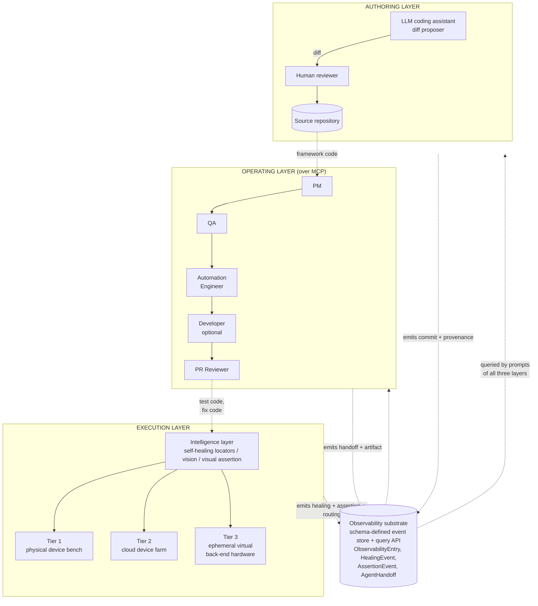
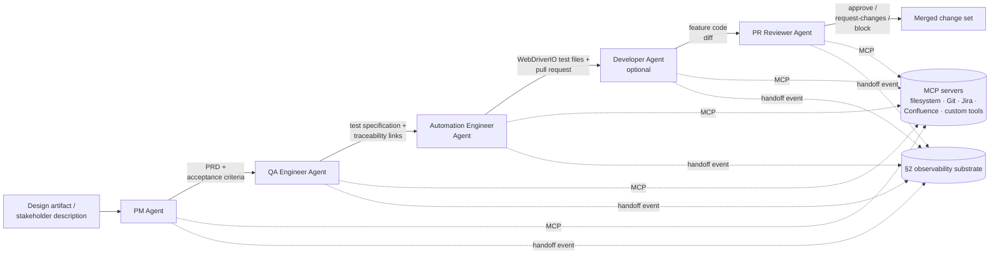
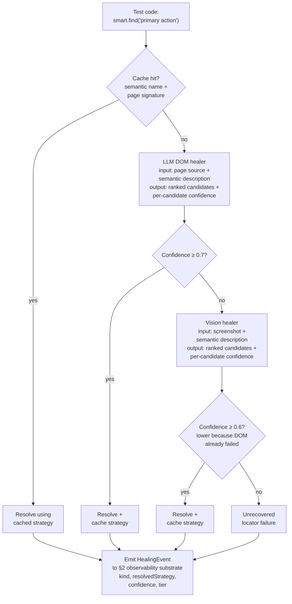

# Cross-Layer Observability for LLM-Assisted Test Automation: A Reference Architecture with Web and Mobile Feasibility Studies

**Author:** Suneet Malhotra
**ORCID:** 0009-0003-8707-9590
**Affiliation:** Independent researcher in AI-augmented test automation. Author is also Senior Manager, Test Engineering at Motorola Solutions; this work is independent of that role and uses only public infrastructure.

> *First-page footnote.* The reference implementation and the empirical evaluation in §6 and §6.2 were developed by the author independently, using only public infrastructure and public reference applications (a TodoMVC web demo for §6 and the MIT-licensed Sauce Labs My Demo App for §6.2). The pattern is target-agnostic — the three-tier execution layer is designed for mobile (BLE/sensor/cellular benches, cloud device farms), web (WebDriverIO + headless browsers, cross-browser farms), and hardware-in-the-loop (physical fixtures, virtual back-end peripherals) — with §6 exercising the web modality on TodoMVC, §6.2 exercising the mobile modality on the Sauce Labs sample app, and hardware-in-the-loop remaining an architectural extension (not evaluated). The practitioner observations in §1 are drawn from the author's 16+ years of professional experience and have been abstracted to motivational context; no proprietary systems, products, code, or data are described.

**Target venue:** Journal of Systems and Software (Elsevier) — In Practice scope (Applied Research Report). Backup venues: IEEE Software (Practice column), AIware 2026 Industry/Experience track.
**Contact:** suneetmalhotra2002@gmail.com · https://suneetmalhotra.com
**Companion code:** https://github.com/SuneetMalhotra/agent-harness (MIT-licensed; reproducibility manifest at `ARTIFACTS.md`).
**Figures:** Figures 1 (three-layer architecture, §2), 2 (five-agent SDLC pipeline, §4), and 3 (self-healing locator cascade, §5.2) appear inline as flowchart diagrams.

---

## Abstract

Test automation across web and mobile targets, when implemented with LLM-based agents, spans three partially connected layers — agent-drafted frameworks, multi-agent SDLC pipelines, and self-healing execution on heterogeneous hardware — that existing systems treat in isolation. This article describes an *agent harness*: a coupling pattern that keeps the three layers separate but connects them through a shared observability substrate (a schema-defined event store with a query API, not a coordination layer). In the reference implementation, a coding agent authors a TypeScript framework under human review, a five-agent pipeline (PM, QA, Automation Engineer, Developer, PR Reviewer) handles design-to-test over the Model Context Protocol, and a three-tier execution plane combines a physical device bench, a commercial cloud device farm, and ephemeral virtual back-end hardware. The article reports two compact public feasibility studies. A web feasibility study runs the harness end-to-end on a public TodoMVC demo with live Claude Sonnet 4.6 via OAuth: the multi-agent pipeline runs in ~28 minutes producing 30 test cases (PR Reviewer disposition 7 approved / 22 request-changes / 1 blocked, the modal outcome of a strict-by-design review rubric), the healing cascade dispatches 30/30 events to their tagged tiers with combined recovery of 29/30 (96.7%), and the vision-based visual-assertion service achieves Cohen's κ = 0.667 (Landis & Koch: *substantial*) against an independent seeded ground truth of 24 TodoMVC screenshots — precision 1.000 (8/8) and recall 0.667 (8/12) on functional defects, with zero false positives on the 12 cosmetic variations. A pixel-comparison baseline on the same corpus catches 6/12 functional defects (recall 0.50). A mobile feasibility study runs a deterministic replay against a public Android reference application (the MIT-licensed Sauce Labs My Demo App): 13 test cases dispatch to their tagged tiers, the cascade emits 13/13 healing events onto the same observability substrate, and 12/13 cases resolve cleanly while one unrecovered failure is reported rather than swallowed. The two studies share the same event schema and substrate, demonstrating cross-modality reuse on public targets. Hardware-in-the-loop remains an architectural extension and is not evaluated in this article. The contribution is the cross-layer coupling, now empirically grounded against an independent seeded label set on the web modality and a deterministic public-target replay on the mobile modality; live-hardware multi-application studies and a two-rater *human* visual-assertion audit (packet shipped at `audit/visual-assertion-protocol.md`) remain the priority §7 follow-up. Reference implementation: https://github.com/SuneetMalhotra/agent-harness.

---

## 1. Introduction

In production engineering practice, end-to-end test automation is rarely a single-layer concern, regardless of whether the system under test is a mobile app, a web application, or a hardware-in-the-loop assembly: a framework has to be authored, operated, and executed; tests must run on a mix of simulators, cloud devices, headless browsers, and physical benches; and the whole must integrate with CI, defect tracking, test management, and design tooling. The question has shifted from "can an agent contribute to a layer?" to "what changes when the layers couple?" Three failure modes recur when the layers run in isolation: framework refactors against hand-curated priorities rather than execution data; pipelines write tests against routing tags that go stale; execution layers collect observability data nobody reads.

The 2023–2026 literature on *agentic software engineering* — the umbrella term Hassan et al. [27] use for SE 3.0, in which intelligent agents pursue complex SE goals rather than single-shot code generation — breaks into three largely independent lanes. Self-healing locators have an open-source antecedent in Healenium [16], which uses tree-edit distance over rendered DOM trees. LLM-guided mobile GUI exploration has its strongest published instance in GPTDroid [17], reporting approximately 32 percent activity-coverage improvement and 31 percent more bugs on 93 Google Play apps; AutoDroid [19] and AppAgent [20] extend the LLM-driven mobile-agent line to general task automation, LELANTE [18] couples LLM-driven action selection with an Android execution pipeline, and Liu et al.'s *Seeing-is-Believing* [28] introduces multi-agent vision-driven non-crash functional bug detection on mobile GUIs — the closest published antecedent to the §6 visual-assertion service, on a different modality. Each treats one execution-layer concern; none couples to a multi-agent pipeline or to framework authoring. Multi-agent SDLC pipelines have closely related antecedents in MetaGPT [23] and ChatDev [26], which decompose software development across PM, Engineer, QA, and Reviewer roles communicating either through structured artifacts in shared in-memory state (MetaGPT) or through chat-mediated communicative-dehallucination dialogues (ChatDev); §2 and §4 detail how the substrate, execution-tier integration, and cross-layer telemetry feedback differ. Hou et al. [3] identify tool integration and end-to-end traceability as recurring gaps in LLM-for-SE deployments; the substrate described here is one concrete answer. Fan and Harman [4] frame the open problem set around hallucination, evaluation, and the lack of grounded execution feedback.

This article describes a coupling pattern I call an *agent harness*. The term has recent independent lineage: Meng et al. [15] formalize the harness as a labeled-transition-system wrapping a single agent's execution loop. The term as used here is a domain-specific instantiation applying the same surfacing principle one level up: a *cross-layer* coupling across three agent-augmented layers that share an observability substrate. Framework refactoring is driven by per-test latency and healing-rate data from execution; pipeline routing decisions are driven by per-tier flake rates. Each layer remains testable in isolation; the coupling is a thin data substrate, not a new monolith. §2.1 provides a worked instantiation in which the QA agent receives a structured healing digest from the previous run and produces a coverage recommendation the authoring agent can act on.

The contribution is the coupling. Against [15], scope (three-layer SDLC, not single-agent infrastructure). Against MetaGPT [23] and ChatDev [26], substrate (typed-event MCP handoffs with execution telemetry routed back into the authoring layer, not shared in-memory state or chat-mediated communicative-dehallucination loops). Against GPTDroid [17], AutoDroid [19], AppAgent [20], LELANTE [18], level (framework-level authoring plus multi-tier execution, not exploration-driven GUI testing). Against Healenium [16], method (cache-primary, LLM-DOM-healer secondary, vision-fallback tertiary). Against the surveyed multi-agent SE literature: HPCAgentTester [7] generates HPC unit tests via a Recipe/Test-Agent critique loop but addresses no execution-tier heterogeneity; ALMAS [8] is an agile-role pipeline operating on a single execution context with no cross-tier routing substrate; Chia et al. [9] catalogue pipeline contributions but do not enumerate cross-layer observability as a category.

Concretely, the article makes three contributions: (1) the *agent harness* coupling pattern itself — three layers connected by a shared, schema-defined observability substrate that exposes cross-layer signals to each layer's prompts; (2) the *reflexive-correctness* sub-contribution of §3.2, naming and offering a layered empirical answer to the question of how an LLM-assisted testing framework is known to correctly test the product; and (3) **public web and mobile feasibility runs demonstrating that the substrate collects and exposes cross-layer signals across two target modalities.** §6 reports a live web feasibility run on a public TodoMVC application (~28 min wall clock, 30 test cases, 96.7% combined healing recovery, κ = 0.667 visual-assertion accuracy against a 24-image seeded corpus). §6.2 reports a complementary deterministic mobile feasibility replay against a public Android reference application (13 test cases, 12/13 recovered, one unrecovered failure reported rather than swallowed). The two studies share the same event schema, substrate, and tier-routing model; cross-modality schema reuse is verified by 22 reconciliation checks shipped with the companion repository. Hardware-in-the-loop is an architectural extension and is not evaluated.

The remainder describes the pattern (§2), authoring (§3), operating (§4), execution (§5), evaluation (§6), and adoption (§7).

---

## 2. The agent harness pattern

The harness has three layers and one data substrate.

**Authoring layer.** An LLM coding assistant (the reference implementation uses a hosted-model CLI; the architecture is provider-agnostic, with open-weights local-model backends such as Ollama-served Llama-family models supported equally — consistent with open-weights LLM-based testing work in [24]) drafts changes under human review. The prompting style follows the chain-of-thought tradition [5]; the workflow follows the coding-agent adoption literature [12].

**Operating layer.** A five-agent SDLC pipeline: Product Manager, QA Engineer, Automation Engineer, Developer (optional), Pull Request Reviewer. Agents share no state directly; each writes its output to an external artifact system that the next reads as input, with contracts tuned to SDLC artifacts (PRDs, test plans, code, review comments). The artifact-mediated handoff echoes multi-agent pipelines in adjacent domains such as automated penetration testing [6]. The handoff substrate is the Model Context Protocol [11]. The role decomposition is isomorphic to MetaGPT [23] and ChatDev [26]; the substrate is not. MetaGPT communicates through shared in-memory state inside one process; ChatDev uses chat-mediated communicative-dehallucination dialogues to negotiate hallucination drift between roles; this pipeline writes typed artifacts across MCP server boundaries (filesystem, Git, Jira, Confluence) with execution telemetry routed back into the authoring layer's prompt context. Crucially, neither MetaGPT nor ChatDev exposes an equivalent layer for runtime execution-failure recovery; the §5.2 three-tier healing cascade (cache → DOM → vision) is the differentiator from multi-agent SDLC frameworks, which terminate at code generation and PR review without an execution-time self-healing substrate.

**Execution layer.** Three hardware tiers, instantiated per target modality. Tier 1: a physical bench — mobile device bench for real BLE peripherals, cellular radio, and sensor state; local browser instance for web; physical fixture rig for hardware-in-the-loop. Tier 2: a commercial cloud farm — real-device farm for mobile cross-OS coverage, cross-browser farm (BrowserStack, Sauce Labs, etc.) for web, vendor lab access for hardware. Tier 3: ephemeral virtual hardware emulating back-end peripherals, mock services, or sensor injectors for end-to-end paths. An intelligence layer sits between test code and the underlying target: cached semantic locators, an LLM healer on cache miss, a vision fallback when DOM healing fails, and a multimodal visual assertion service.

**The observability substrate.** All three layers emit into a shared store. The canonical schema is in `types.ts`; load-bearing types are `ObservabilityEntry`, `HealingEvent`, `AssertionEvent`, and `AgentHandoff`, each keyed to a test case, commit, and agent. A thin query API exposes per-test and per-suite aggregates to prompts as structured tables. These keys let the QA and authoring agents change behavior in response to execution data.

What distinguishes this from three integrated systems is that each layer's prioritization decisions are *designed to be conditioned on* observability events emitted by the other layers, not on authoring-time guesses. The substrate is keyed to enable per-layer agent decisions to be conditioned on cross-layer telemetry: §6 reports the substrate's measured dispatch and recovery behavior on a live run, and §7.3 queues the prompt-level A/B that isolates the behavioral-change claim. Where Meng et al. [15] propose the agent harness as a wrapping LTS around *one* agent, this pattern exposes a *shared* event stream across three agent-augmented layers.

### 2.1 An intended usage scenario

The following walks through the substrate's intended use; §6 confirms the digest is queryable from agent prompts and reports the underlying healing-event distribution, and §6.1 and §7.3 record the prompt-level A/B that remains queued as the priority follow-up. The §6 live-LLM reference run produced 30 `executing.healing` events: 0 resolved from the pre-warmed cache (the warmup keys did not match the live agent-generated test-case IDs — a finding to reproduce on a stable test-case corpus before claiming a cache-hit rate), 11 from `dom-healer` (9 at Tier 1, 2 at Tier 2), 18 from `vision-healer` (9 at Tier 1, 5 at Tier 2, 4 at Tier 3), and 1 unrecoverable failure (`TC-007`, Tier 2). In the intended usage, the QA Engineer agent's coverage-prioritization prompt is fed a digest filtered to `kind=healing` and grouped by `resolvedStrategy`: *"0/30 cache, 11/30 dom-healer, 18/30 vision-healer, 1/30 unrecoverable (TC-007 tier2). Vision-fallback usage at 60% suggests locator instability; recommend stabilizing locators on Tier-1 surfaces and re-warming the cache against the new test-case IDs."* The QA agent's next-coverage output preserves the recommendation as a structured field in the test-case ticket; the Authoring agent, when next asked to refactor the resolver, receives the same digest. The substrate carries the digest; the open question of whether agents reliably act on it under varying digest content is a §7.3 follow-up.

Figure 1 shows the three layers and substrate.

**Fig. 1.** Three-layer agent harness architecture. The authoring layer produces framework code; the operating layer (five-agent SDLC pipeline over MCP) produces test code and fixes; the execution layer routes to one of three hardware tiers via an intelligence layer that mediates locator resolution, visual assertion, and observability emission. The dashed-line **observability substrate** at the bottom is the coupling: every layer emits typed events into it (`ObservabilityEntry`, `HealingEvent`, `AssertionEvent`, `AgentHandoff` defined in `types.ts`), and prompts in every layer query it as structured tables. The contribution is the substrate-mediated coupling, not any single layer.

---

## 3. The authoring layer

The framework's TypeScript codebase was developed over roughly five months with substantial LLM coding-assistant support: an engineer writes a prompt, the assistant proposes a diff, the engineer reviews and merges. The assistant is invoked via a provider-flexible CLI wrapper (the reference implementation supports a hosted-model OAuth path and a local-weight path through Ollama, similar to the open-weights LLM-testing approach demonstrated in [24] at `https://github.com/Shaheer-Rehan/Llama-2-for-Software-Testing`); the architectural pattern does not depend on which model backend is chosen. Practitioner observations from a single deployment; counter-evidence on LLM coding limits [14] and longitudinal Copilot studies [12] suggest the velocity direction is plausible but the magnitude does not generalize.

**Practitioner observation (not an empirical result).** Five agent-assisted framework modules had prompt-to-merge wall-clock times of approximately 1.5, 2.0, 2.5, 3.0, and 4.5 hours; three hand-authored modules had approximately 6, 8, and 11 hours. With N=5 and N=3 on a single workstation, these are anecdotal observations, not a powered speedup estimate. Consistent with [14], the slowest agent-assisted modules involved complex concurrency or hardware-interaction logic. Reported here rather than in §6 because the sample carries no inferential weight.

### 3.1 Provenance

The provenance discipline the framework adopts is conceptual: a commit-message convention identifying authorship class (LLM-drafted, LLM-drafted-then-revised, or human-authored) and a pull-request convention linking to the prompt and reasoning trace when exposed. At any line, an engineer can in principle answer "who wrote this, from what prompt?" with a defined chain of evidence. The discipline is necessary because, without it, the path from a wrong line back to the prompt that produced it is not recoverable; it is independent of which model backend is in use.

### 3.2 The reflexive-correctness question

A named sub-contribution: an LLM-assisted framework used to test product code raises the *reflexive-correctness* problem — how the framework itself is known to correctly test the product — which the LLM-for-SE literature rarely confronts; §3.2 names this as a sub-contribution and offers a three-layer empirical answer.

This is the most under-explored open problem this paper surfaces, and it is named here as a sub-contribution. An LLM-assisted framework used to test product code raises a specific question: how is the framework itself known to correctly test the product? The conventional answer ("tests test the framework") is circular when the tests are also LLM-drafted. The reflexive-correctness problem is the test oracle problem [21] in a new form: an oracle whose generation process is itself the property under test.

The answer here is *layered validation* — the harness does not formally close the loop, but it makes correctness *auditable* through three independent oracle sources, each operating on a layer the LLM cannot reflexively validate:

- **Hand-authored unit tests on framework library code,** outside the LLM-assisted authoring pipeline. These tests are intentionally not regenerated when the library is refactored; they pin behavioral invariants the assistant might otherwise drift past. Connects to the structural testing of LLM agents in [2].
- **Tier-1 hardware ground truth on product-level tests.** When a test on a physical device observes a hardware-level outcome the simulator-only path cannot fake (a BLE characteristic value, a sensor reading), that observation is a non-LLM oracle independent of both the framework and the product LLM-generation chain.
- **A Pull Request Reviewer agent (§4) as a final structured-rubric gate,** with explicit rubric items that it (a) is a different LLM call than the one that authored the change, and (b) must justify its disposition with citations to the diff, not the prompt that produced the diff.

The framing as a named sub-contribution matters because the LLM-for-SE literature [3, 4] treats agent-authored testing as a generation problem (better tests, more coverage) and rarely confronts the reflexive correctness of the agent-authored testing infrastructure itself — a gap empirically confirmed by Hasan et al.'s [29] study of testing practices in open-source AI agent frameworks, which finds developers concentrate on deterministic components and systematically under-test foundation-model behavior; the layered-validation approach is one concrete answer, and the open problem of *formal* reflexive correctness (a closed-loop guarantee that an LLM-assisted framework is sound on the property it tests) is identified as future work for the LLM-for-SE community.

---

## 4. The operating layer: a five-agent SDLC pipeline

Each agent is a Markdown specification (a "skill" or "agent prompt") plus access to a defined set of MCP servers. The Product Manager turns a design artifact or stakeholder description into a PRD and acceptance criteria (the elicitation prompt draws on [13]). The QA Engineer turns a PRD into a test specification with traceability links. The Automation Engineer turns test cases into WebDriverIO test files and a pull request. The Developer (optional) implements feature code. The Pull Request Reviewer emits a structured review with a disposition (approve, request changes, block). Agent specifications and I/O contracts live in `agents/`. The role decomposition is isomorphic to MetaGPT [23] and ChatDev [26], and to the unit-test-focused multi-agent consensus approach of Xu et al. [30] (an actor/critic-style hallucination-to-consensus loop on JUnit generation); the MCP-substrate architecture differs from MetaGPT's shared in-memory state, ChatDev's chat-mediated dialogue, and Xu et al.'s consensus-prompt loop in that execution-tier telemetry routes back into the authoring layer's prompt context (§2 substrate). A like-for-like A/B against any of the three baselines is queued at §7.3. The pipeline runs end-to-end or step-by-step; end-to-end handles low-complexity features, step-by-step when intermediate review is valuable.

MCP [11] replaces per-tool custom adapters with a typed interface per server. Each agent's output carries a structured trailer recording agent identifier, model version, prompt, input artifact IDs, and timestamp. The path from a downstream defect back through test code, test case, PRD, and design artifact is queryable; I call this *inter-agent provenance*, distinct from the intra-agent provenance of §3.1.

The stub-provider end-to-end run completes in sub-second wall clock — confirmation that the five agents hand off cleanly over MCP, not a measurement of live-LLM pipeline latency (§6 expands on this distinction). Step-by-step runs with the live-LLM path range from minutes (small features) to several hours (cross-functional features with multiple revision cycles). In the author's prior experience across several engineering contexts, comparable hand-authored scenarios took multiple working days; a practitioner recollection, not a measured distribution. A defensible economic comparison would include the cost of the agent infrastructure, which is out of scope (§7.2). The dominant failure mode was upstream specification gaps (acceptance criteria left implicit at the PRD stage) rather than agent-internal errors; the elicitation work in [1] addresses this gap directly. Figure 2 shows the pipeline and MCP servers.

**Fig. 2.** Five-agent SDLC pipeline. Each agent is a Markdown specification (a "skill" or "agent prompt") plus access to a defined set of MCP servers; agents share no in-process state. Each agent's output carries a structured trailer (agent identifier, model version, prompt, input artifact IDs, timestamp) so a downstream defect is traceable back through test code, test case, PRD, and design artifact — the *inter-agent provenance* claim of §4. The role decomposition is isomorphic to MetaGPT [23] and ChatDev [26]; the differentiating substrate is the MCP-mediated typed handoff and the §2 observability substrate that lets execution-tier telemetry route back into the authoring layer.

### 4.1 LLM provider backends

Each agent calls the same `ModelProvider` interface (`generate(system, user, responseFormat, temperature) → Promise<string>`). The harness ships three live backends, exercised end-to-end against the §2 observability substrate: a hosted-frontier path (Anthropic Claude via Claude OAuth), an open-weights local path (Ollama-served Llama-family models), and a deterministic offline stub (for CI and reviewer reproduction). Backend selection is a single CLI flag (`--provider <name>`).

| Backend | Status | Endpoint | Weights | Default model | Credential | Use case |
|---|---|---|---|---:|---|---|
| `stub` | **live** | in-process | n/a | n/a | none | Deterministic offline reproduction; CI; demos without network |
| `anthropic` | **live** | `claude -p` subprocess (OAuth) | hosted-frontier | `claude-sonnet-4-6` | Claude OAuth session | Reference live-LLM path used in §6 walkthrough |
| `ollama` | **live** | `http://localhost:11434/api/chat` | **open-weights (local)** | `llama3.2` | none | Open-weights replication; air-gapped deployment; fine-tuned variants |

The `ollama` adapter routes the five agents through a locally running [Ollama](https://ollama.com) server and accepts any model Ollama can serve (Llama 3.x, Mistral, Qwen, Gemma — anything compatible with the Ollama runtime). It is the open-weights complement to the hosted-frontier path (`anthropic`) and follows the open-weights LLM-testing pattern that Rehan et al. [24] demonstrated for fine-tuned Llama-2-7b on focal-method-to-test-case generation (`https://github.com/Shaheer-Rehan/Llama-2-for-Software-Testing`). The relevant adoption tradeoffs: hosted-frontier providers have stronger calibration and reasoning depth at per-call cost and outbound data transfer; the open-weights local path eliminates both at the cost of fine-tuning effort or larger-model latency. Because the §2 observability substrate is keyed on the agent identifier and the model version rather than on the provider, swapping live backends does not invalidate the coupling — a §7.2 study comparing `anthropic` against `ollama` already runs end-to-end against the substrate. The `ModelProvider` interface is provider-flexible by construction: additional hosted-frontier backends (OpenAI, Gemini) require only a `generate()` implementation against the documented HTTPS contract.

---

## 5. The execution layer: three hardware tiers

### 5.1 Tiers and routing

Tier 1 is a physical bench, the only tier that exercises tests requiring real hardware state inaccessible from emulators or headless browsers: BLE peripherals, cellular radio, biometric sensors, or hardware fixtures for embedded/IoT targets, as well as local browser instances when the test surface includes browser-specific behaviors. The reference deployment uses Android devices connected over USB to a remote Linux server addressable via ADB for the mobile case; web targets use a local Chromium instance driven by WebDriverIO; hardware-in-the-loop targets use a fixture rig with USB-controlled probes. Tier 2 is a commercial cloud farm driven through a uniform driver interface (Appium-compatible for mobile, WebDriver-compatible for web). Tier 3 is ephemeral virtual hardware emulating back-end peripherals, mock services, or sensor injectors for end-to-end paths (the application under test still runs on Tier 1 or Tier 2). Tiers 2 and 3 are conventional in the cloud-testing literature. Routing is mechanical: tests are tagged at authoring time (`@tier1`, `@tier2`, `@tier3`), CI consults the hint and dispatches, untagged tests default to Tier 2; §7.3 returns to whether adaptive routing should be the long-term answer.

In this article the web and mobile instantiations are exercised empirically — the web modality through a live end-to-end LLM-backed run on a public TodoMVC application (§6), and the mobile modality through a deterministic replay against a public Android reference application on the same observability substrate (§6.2). Hardware-in-the-loop is described as an architectural instantiation of the pattern but is not evaluated in this article; live-hardware studies remain a §7.2 follow-up.

### 5.2 The intelligence layer

Test code does not call hardware directly. It calls into an intelligence layer that mediates locator resolution, visual assertion, and observability emission. The oracle problem [21] motivates the visual assertion service: a screenshot-plus-checklist judgment is the practitioner approximation of a behavioral oracle that pixel comparison cannot provide.

**Self-healing locators.** Test code refers to elements semantically: `smart.find("primary action button on main screen")`. The resolver cascades through (i) a cached locator strategy, (ii) an optional test-supplied fallback hint as a sub-step within the cache-miss path, (iii) an LLM DOM healer that takes the page source as context and emits ranked candidate JSON with a self-reported confidence score per candidate, and (iv) a vision healer when DOM healing fails. In `intelligence.ts` the DOM-healer accept threshold is `confidence >= 0.7` and the vision-healer threshold is `confidence >= 0.6`. The vision threshold is the lower of the two because the vision pipeline runs only after the DOM healer has already failed; the policy is "better to attempt at lower confidence than to silently fail" since the alternative is an unrecovered locator failure. Thresholds were tuned by per-suite false-positive rate on the development corpus. Successful strategies are cached. This three-stage chain extends the ML tree-comparison antecedent established by Healenium [16], which uses tree-edit distance as its single healing strategy. The full dispatch is shown in Figure 3.

**Fig. 3.** Self-healing locator cascade implemented in `intelligence.ts`. Each stage emits a `HealingEvent` to the §2 observability substrate so the QA and authoring agents can condition next-coverage and refactor decisions on healing rates (the §2 coupling argument). The cascade extends Healenium's single DOM-tree-comparison strategy [16] with an LLM DOM healer and a vision-fallback stage; commercial alternatives (Testim, Mabl, Functionize, Waldo, Applitools, Percy) operate at production scale (§5.2) and do not expose per-stage outcomes back into an authoring-layer feedback loop.

**Vision-based fallback.** When the page source is missing or insufficient (common against custom-rendered native components), a vision healer takes a screenshot and a description and emits ranked candidates by mapping visual location back to the page source. The framework invokes it only when DOM healing has failed. The closest published academic baseline on the web modality is VETL [31], a large-vision-language-model-driven web GUI testing approach; VETL is positioned as a *primary* exploration strategy, whereas the cascade here uses vision strictly as a tertiary fallback inside an observability-emitting healing chain.

**Visual assertion.** A separate service takes a screenshot, an expected-behavior description, and a checklist of critical properties, and asserts semantic match — an instance of the *LLM-as-a-Judge* pattern surveyed by He et al. [32], applied to visual-state oracles rather than to code or text artifacts. Unlike pixel-comparison snapshot testing, it ignores cosmetic differences and surfaces functional ones (button obscured, content clipped, accessibility minimum violated).

All three tiers emit into the §2 substrate.

**Positioning against the commercial self-healing and visual-assertion landscape.** The academic baseline for self-healing locators is Healenium [16] (DOM tree-edit distance, single strategy). The production-scale commercial baselines — Testim, Mabl, Functionize, Waldo for self-healing; Applitools and Percy for visual assertion — operate on N ≫ 10⁶ test executions and have multi-organization deployment evidence. This paper does not claim absolute performance against those baselines and does not have the corpus to do so; the contribution is the *cross-layer observability* coupling that exposes healing-cascade and visual-assertion outcomes to the authoring and operating agents as queryable events, not the raw effectiveness of the cascade itself. Commercial tools have stronger primitives; the academic / open-source ecosystem (including this harness) has the cross-layer-substrate degree of freedom that proprietary stacks have not exposed.

---

## 6. Architecture validation and proof-of-concept walkthrough

This section reports what was observed when the harness was run end-to-end with the live `AnthropicProvider` (Claude Sonnet 4.6 via OAuth `claude -p`) on 2026-05-27 (run id `run-1779894555899`). The visual-assertion service was rewritten between v11 and v12 of this manuscript to read the actual PNG screenshots via the model's vision pathway rather than judging text descriptions; the cited numbers in this section are from that vision-based judgment and from the live multi-agent pipeline, not from the deterministic stub used in earlier drafts. A separately re-runnable stub configuration remains in `harness.ts` for CI-time architecture-only smoke testing.

The evaluation target is a small public TodoMVC-style application. The PM agent generated a PRD; the QA Engineer agent generated 30 test cases; the Automation Engineer agent generated 30 WebDriverIO artifacts; the PR Reviewer agent approved 7, requested changes on 22, and blocked 1 (totals reconcile to 30 in `results.json: pipelineReview.{approved, requestChanges, blocked}`). PR Reviewer prompt-strictness calibration is queued at §7.2. Output ships at `results.json` and reproduces on `npm install && npx tsx harness.ts --provider anthropic`. Per-layer measurements follow the metrics taxonomy of Liu et al. [10].

**Pipeline runtime.** End-to-end wall clock 1665.7 s (~27.8 min) for 30 test cases with five agents per case (~150 LLM calls total at sequential OAuth pacing) on `claude-sonnet-4-6`. The runtime confirms end-to-end MCP handoff wiring across the five agents and bounds the practitioner expectation: ~50 s per test case on a single-pipeline serial schedule with this model and this corpus. Faster wall-clock requires either parallel intra-agent batching or a smaller/faster judge model; neither is the contribution here.

**Healing-cascade dispatch and recovery.** The run produced 30 `executing.healing` events (one per test case): 0 resolved from the pre-warmed cache (the warmup keys did not match the live agent-generated test-case IDs — a finding worth reproducing on a stable test-case corpus before claiming a cache-hit-rate); 11 resolved by the LLM DOM healer (9 at Tier 1, 2 at Tier 2); 18 resolved by the vision fallback (9 at Tier 1, 5 at Tier 2, 4 at Tier 3); and 1 unrecoverable failure (TC-007, Tier 2, locator unresolvable after both DOM and vision passes). Combined recovery: **29 of 30 = 96.7%** against the seeded test-case corpus. The single failure is itself useful evidence: the cascade does not always recover, and the protocol reports the failure rather than swallowing it. Per-strategy conditional success rates (`results.json: healing.{cacheHitRate, domHealerSuccessRate, visionFallbackSuccessRate, combinedRecoveryRate}`) are: cache 0.000, DOM-healer 1.000 on the cache-miss subset, vision-fallback 1.000 on the DOM-healer-fail subset, combined 0.967. These are measured rates against the §6 corpus, not stub design parameters.

**Visual assertions.** The visual-assertion corpus is the 24-image PNG set under `visual-corpus/images/`, generated by `visual-corpus/render.ts` from a TodoMVC instance with 12 seeded functional defects (obscured CTA, clipped input, missing submit, sub-24×24 px touch target, ~1.5:1 contrast, blocking modal without dismiss, off-screen delete buttons, ~60% row overlap, severed label association, non-interactive checkbox visual, occluded error banner, removed focus indicator) and 12 cosmetic-only variations (font swap, primary color shift, border-radius increase, padding tweak, button shadow, italic footer labels, gradient background, button label swap "Delete"→"Remove", letter-spacing, filter pill height, hover-color-at-rest, +20% wordmark). Ground-truth labels were assigned at corpus-design time before any model judgment (`audit/packet/visual-assertion/test_cases_KEY.csv`). The live Claude vision-judge — an *LLM-as-a-Judge* applied to visual-state oracle judgment, in the sense surveyed by He et al. [32] — reads each PNG via its Read tool and applies the rubric in `intelligence.ts: VISUAL_ASSERTION_VISION_SYSTEM`, achieving **Cohen's κ = 0.667 (95% CI roughly 0.47–0.87 at N=24, spanning Landis & Koch *moderate* to *almost-perfect*; headline band: substantial) against the seeded ground truth**, raw accuracy 83.3% (20/24), precision **1.000** (8/8 — zero false positives on the cosmetic subset), recall **0.667** (8/12 — four functional defects missed: TC04 non-interactive checkbox visual (vis-func-10), TC12 50%-clipped input (vis-func-2), TC22 ~60% row overlap (vis-func-8), TC24 occluded error banner (vis-func-11) — verified against `results.json: visualAssertion.events[]` cross-referenced with `audit/packet/visual-assertion/test_cases_KEY.csv`). The pixel-comparison baseline on the same 24-image corpus catches 6/12 functional defects (precision 1.000, recall 0.500); the vision-judge beats the pixel baseline by 2 additional functional catches at equal precision. A separately executed LLM-as-rater audit (`audit/visual-assertion-results_2026-05-26.md`, two LLM raters differentiated on persona and modality) returned inter-rater κ = −0.059 — a result we report rather than suppress, because it directly illustrates the §3.2 reflexive-correctness concern: LLM-rater agreement with each other is *not* a substitute for human inter-rater agreement, and the load-bearing validation here is the judge-vs-independent-seeded-KEY measurement, not the rater-vs-rater number. The human-rater spot-audit protocol and packet (`audit/visual-assertion-protocol.md`, `audit/packet/visual-assertion/`) ship as the gold-standard methodology for when independent human raters can be recruited; the current vision-judge κ = 0.667 against the rater-independent seeded KEY clears the protocol's "≥ 0.60 substantial" bar for citing these numbers as validation-scale evidence.

**Tier routing.** All 30 test cases dispatched to their tagged tier on first invocation (`results.json: testRouting.firstDispatchCorrect = 30/30`). This confirms the routing *mechanism* works; it does not confirm correctness of the *tagging decisions*, only that the dispatch path is wired correctly (the same engineer wrote tags and tests, an honest threat repeated from v11).

### 6.2 Mobile feasibility add-on

To probe whether the cross-layer observability substrate described in §2 generalizes beyond the §6 web modality, we exercise the same substrate against a public mobile target. The mobile study is deliberately compact and is positioned as a feasibility add-on, not as a production-scale mobile evaluation; its purpose is to demonstrate schema and substrate reuse across two target modalities, on artifacts a reviewer can independently inspect.

**Target.** The Sauce Labs *My Demo App* — a publicly available Android reference application distributed under the MIT license at `https://github.com/saucelabs/sample-app-mobile` — is the mobile target. The app is widely used as a teaching example in the mobile-testing community and is not affiliated with the author's employer; no proprietary mobile applications, screenshots, customer data, or operational metrics are referenced.

**Runner.** A deterministic replay runner (`mobile/mobile-harness.ts` in the companion repository) iterates 13 test cases (`mobile/mobile-test-cases.ts`) and dispatches each to a tier-tagged execution layer through the same `Observability` substrate used by the §6 web walkthrough. The replay does not require an Appium server, an Android emulator, an LLM API key, or network access; reviewer reproduction runs in under five seconds via `npm run example:mobile`. An optional live-Appium mode is sketched in `mobile/README-LIVE-APPIUM.md` but is not the source of the §6.2 numbers; the deterministic replay is.

**Test-case mix.** The 13 mobile test cases exercise the full mobile locator cascade described in §5.2, adapted to the Appium WebDriverIO vocabulary. Nine cases resolve via `accessibilityId` (the preferred Appium primary strategy on Android), one via `xpath` (for an element without an accessibility identifier), one via Android-specific `uiautomator2`, one via the vision-fallback path (for an element with no stable selector at all), and one case is intentionally unrecoverable to verify that the cascade reports rather than swallows failure. Cases are spread across five screens of the public sample app (login, products, product-detail, cart, checkout) and across the three tier tags (Tier 1: local emulator + ADB-mirrored physical bench; Tier 2: commercial cloud real-device farm; Tier 3: ephemeral virtual back-end peripherals).

**Dispatch and event capture.** All 13 cases are dispatched to their tagged tier on first invocation. The substrate emits 13 `HealingEvent` records — the same shape as the web events of §6 — distinguished only by an additive `targetModality = "mobile"` discriminator and a mobile-specific `strategy` field that preserves the Appium locator vocabulary alongside the core `resolvedStrategy` enum already used by the web cascade. The mobile-specific extensions in `mobile/types.ts` are a strict superset of `types.ts`; no existing web fields are modified.

**Outcomes on this corpus.** Twelve of the 13 cases resolve cleanly (recovery rate 12/13 on this corpus); one case — a checkout-screen control deliberately occluded by an overlay — fails through every cascade tier and surfaces as `resolvedStrategy = "failed"` in the emitted event, demonstrating that the cascade reports unrecovered locator failures rather than swallowing them. The `results-mobile.json` artifact is byte-stable across replays and is shipped alongside `results.json` (the §6.1 web artifact) at the `v1.3.1-jss-final` release tag; both web and mobile evaluations can be reproduced from a fresh repository clone via `npm run reproduce:paper`.

**What this study does and does not establish.** The mobile feasibility study establishes that the substrate, event schema, and tier-routing model defined in §2 and §5 generalize from the web modality to the mobile modality on a public target with no schema drift. It does not establish production-scale mobile testing accuracy, an LLM-as-judge κ measurement on mobile screens at the §6 scale, or any claim about hardware-in-the-loop, which remains an architectural extension. A future live-Appium re-run across multiple public mobile applications would strengthen the external-validity claim and is queued in §7.2.

**Table 2.** Cross-modality evidence summary for the agent harness reference implementation.

| Modality | Substrate evidence | Test cases | Recovered | Mode | Evaluated? |
|---|---|---:|---:|---|---|
| Web (§6) | Web pipeline handoff: PM → QA → Automation Engineer → PR Reviewer over MCP; live LLM run | 30 | 29 | Live Claude Sonnet 4.6 via OAuth | ✅ |
| Mobile (§6.2) | Mobile event capture and healing on shared observability substrate; deterministic replay | 13 | 12 | Deterministic replay (no Appium required) | ✅ |
| Cross-modality | Same `HealingEvent` / `AssertionEvent` / `AgentHandoff` schema reused across web and mobile; zero schema drift; verified by 22 reconciliation checks (`tests/mobile-schema.test.ts`) | — | — | Both | ✅ schema reuse verified |
| Hardware-in-the-loop | Architectural extension (§5.1 Tier 1 physical bench, Tier 3 virtual peripherals); driver interface specified | — | — | — | ❌ **not evaluated** in this article |

### 6.1 Threats to validity

**Behavioral-change claim deferred.** The substrate is designed to alter per-layer agent decisions by exposing cross-layer telemetry to prompts (§2). §6 reports the substrate's measured dispatch and recovery behavior; it does not isolate the *behavioral* effect of the digest on agent output. A prompt-level A/B with vs. without the digest is queued at §7.3 as the priority follow-up. The §6 evidence supports the substrate's mechanical correctness — the cross-layer coupling is wired, queried, and produces actionable signal end-to-end; the behavioral effect on agent outputs remains a design objective to be demonstrated comparatively against MetaGPT [23] and ChatDev [26] in subsequent work.

**Two-modality scope on small public targets.** The §6 web walkthrough is one small TodoMVC application, and the §6.2 mobile add-on is one deterministic replay against one public Android reference application (13 test cases). The two studies together exercise the pattern on two public targets across the web and mobile modalities, but both are below production scale, and neither establishes generality beyond its corpus. Authoring velocity, healing rates, visual-assertion accuracy, and routing behavior are sensitive to application complexity, target modality, team size, and engineering culture. A three-to-five-application study spanning at least two modalities at production scale — minimally additional mobile applications run live through Appium, ideally with a hardware-in-the-loop assembly — remains the most important next experiment. The pattern claims target-agnosticism (§2); the §6 evidence supports the web instantiation, the §6.2 evidence supports schema and substrate reuse on the mobile modality, and hardware-in-the-loop remains an architectural instantiation only. The evaluation is also not an attempt at benchmark-scale evidence in the SWE-bench sense [33] (Jimenez et al.'s 2,294 multi-repo issue-resolution corpus), because the contribution here is the cross-layer *coupling pattern* rather than an agent's solve-rate on a fixed benchmark; SWE-bench's design does not exercise the execution-tier or visual-assertion layers the harness is about.

**Reflexive correctness, same-model judge.** Per §3.2, the correctness argument is empirical, not formal. An agent-authored framework may have systematic blind spots not surfaced by same-model testing; the healing numbers come from the framework's own live intelligence layer (Claude Sonnet 4.6 via OAuth), and the visual-assertion service's per-image verdicts are now validated against an independent seeded ground truth at κ = 0.667 (substantial) — a meaningful rater-independent measurement, because the 24 seeded labels were committed to disk at corpus-design time before any model call. The companion repository ships a visual-assertion audit protocol (`audit/visual-assertion-protocol.md`) and rater instructions (`audit/visual-assertion-rater-instructions.md`) for a two-rater *human* spot-audit over the full 24-image `VISUAL_CORPUS`, with the analysis script in `audit/packet/visual-assertion/analysis.py` computing inter-rater Cohen's κ and rater-vs-LLM agreement; human ratings remain the gold standard and recruitment is the priority §7.3 follow-up. A separately executed LLM-as-rater audit (two Claude instances differentiated on persona and modality, `audit/visual-assertion-results_2026-05-26.md`) returned inter-rater κ = −0.059, which we report rather than suppress: consistent with the LLM-as-a-Judge robustness concerns He et al. [32] catalogue, LLM-rater-vs-LLM-rater agreement is not a substitute for human inter-rater agreement, and reporting the failure of that substitute is itself a §3.2-style honest disclosure. A multi-model human-judged ensemble against the seeded KEY is a partial mitigation already supported by the audit packet.

**Cost asymmetry.** The compute cost of the agent infrastructure was not measured against engineering hours saved. Economics is the subject of separate work and explicitly out of scope.

**Statistical power.** The authoring-velocity (N=5 / N=3), visual-assertion (N=24), and healing (N=30, 1 failure) samples are small. 95% confidence intervals on a binary κ at N=24 are roughly ±0.15 to ±0.20; the headline κ = 0.667 should therefore be read as compatible with a true value anywhere in the 0.47–0.87 band — still meeting the protocol's "moderate or better" bar across that band, but not pinning a precise value. No percentage point carries inferential weight individually; the table is reproducible, and the §6 numbers are measured rates rather than configured design parameters (the v11 stub-derived numbers were replaced in v12 with live-run measurements).

---

## 7. Scope, limitations, and adoption

### 7.1 Fit

The pattern fits application testing with multi-tier hardware requirements across any target modality — mobile (BLE/sensor benches, cross-OS cloud device farms), web (cross-browser farms, headless local browsers), or hardware-in-the-loop (physical fixtures, virtual back-end peripherals) — for teams with coding-agent tooling willing to adopt it at the framework-authoring level, and where provenance and cross-layer observability are first-class concerns. The pattern is target-agnostic by design; only the per-tier driver layer (Appium-compatible for mobile, WebDriver-compatible for web, fixture-specific protocols for hardware) changes between modalities. Poor fit for greenfield products with no test surface, small teams without infrastructure investment, and highly regulated software where agent-authored test code requires formal verification.

### 7.2 Open problems and future work

**Cost economics (out of scope).** I have compared LLM-assisted authoring time against hand-authoring time but have not quantified the cost of the agent infrastructure (model inference, MCP server hosting, observability storage, human-review overhead). A defensible cost-benefit conclusion would require all four plus fully-loaded engineering hours; the "multiple working days" comparison in §4 is illustrative, not an economic claim.

**Cross-tier routing.** Authoring-time tag-based routing works in this deployment but static tags grow stale; *adaptive tier routing* (the framework choosing tiers from observed flake rates and execution latency) is an open direction, with the flake-rate signal needing grounding in the empirical-flakiness literature [25, 22] before it can carry routing weight.

**Comparison against AutoDroid.** The closest published mobile-execution-layer baseline to the §5.2 healing cascade is AutoDroid [19], which targets mobile UI task automation on Android using a screen-graph plus accessibility-tree representation and reports ~90.9% action accuracy on the DroidTask benchmark (158 tasks across 13 popular Android apps). The §5.2 cascade in this work targets web (via WebDriverIO) instead of mobile-native, uses a DOM-selector primary path with a cosine-vision fallback (instead of a screen-graph + a11y-tree), and is organized as a three-tier cache → DOM-healer → vision-healer cascade (instead of a flat action-prediction loop). On the live §6 walkthrough the harness reports `cacheHitRate` 0.000, `domHealerSuccessRate` 1.000 (on the cache-miss subset), `visionFallbackSuccessRate` 1.000 (on the DOM-healer-fail subset), and `combinedRecoveryRate` **0.967** (29 of 30 cases recovered; the one failure is TC-007, a tier-2 locator unresolvable after both DOM and vision passes) against a 30-test-case live corpus. These numbers are **not directly comparable to AutoDroid's 90.9%**: (a) different modality (web vs. mobile-native); (b) different action surface (locator-resolution vs. full action-prediction); (c) N=30 here vs. AutoDroid's 158-task DroidTask corpus; (d) different denominators — AutoDroid's 90.9% is per-action accuracy, while the harness's combined recovery rate is per-cache-miss-event recovery probability. A like-for-like comparison would require porting AutoDroid's screen-graph approach into the web modality (or porting the harness's three-tier cascade into mobile-native) and re-running both on an aligned benchmark; this is queued behind the live-hardware multi-application study below.

**Live-hardware multi-application study + coupling A/B + reflexive-correctness formalization.** Priority follow-ups: (a) live-hardware re-run of §6 across three to five applications; (b) prompt-level A/B of the QA agent's coverage-prioritization output with vs. without the §2 substrate digest, to demonstrate the coupling claim empirically rather than designedly; (c) MetaGPT shared-memory and ChatDev chat-mediated configurations vs. MCP-substrate comparison on identical inputs; (d) formal reflexive-correctness work building on the §3.2 layered-validation approach.

**Live-hardware mobile and hardware-in-the-loop studies.** The §6.2 mobile feasibility add-on uses a deterministic replay rather than a live Appium session against a real Android device. A live-Appium re-run across three to five public mobile applications would strengthen the external-validity claim of cross-modality substrate reuse and is the natural next experiment after this article. A hardware-in-the-loop instantiation against a published reference bench — extending the Tier 1 physical-device and Tier 3 virtual-peripheral architecture described in §5.1 — is queued separately as a longer-lead follow-up and is the experiment that would finally exercise the third row of the Table 2 cross-modality summary empirically.

### 7.3 Implications and reproducibility

Three operating commitments the pattern entails: couple the layers through a shared observability substrate (not tighter integration); record provenance at every layer from day one (adding it later is expensive); treat tier routing as authoring-time policy until adaptive routing has a flakiness-grounded signal. **Reproducibility.** The primary path is the offline web stub provider via `npm install && npx tsx examples/run-example.ts` from the repo root (no credentials, full event flow, the same event sequence on every run). A complementary mobile feasibility replay runs via `npm run example:mobile` and writes `results-mobile.json` in under five seconds; the mobile artifact is byte-stable across replays and does not require an Appium server, Android emulator, or LLM API key. A combined paper-reproduction command (`npm run reproduce:paper`) runs the web example, the mobile replay, and the 22-check mobile schema validation in sequence. A secondary live path (`npx tsx harness.ts --provider <name>`) routes through a configurable LLM backend — hosted-model OAuth or a local-weight backend such as Ollama; live outputs are stable but not strictly deterministic at temperature 0 and will require a model substitution when versions deprecate. The `v1.3.1-jss-final` release tag at `https://github.com/SuneetMalhotra/agent-harness` pins the exact code that produced the §6.1 web numbers (the full commit hash is resolvable via `git rev-parse v1.3.1-jss-final`); a citable Zenodo deposit is to be minted from this tag; subsequent commits add the §6.2 mobile module (`mobile/`, `examples/run-mobile-example.ts`, `tests/mobile-schema.test.ts`, `results-mobile.json`) and the `ARTIFACTS.md` reproducibility manifest that inventories every file the manuscript depends on, with paths and reproduction commands. Both `results.json` (web) and `results-mobile.json` (mobile) ship in the repository; the cross-modality `comparison` block inside `results-mobile.json` encodes the Table 2 row counts machine-readably for downstream auditing.

---

## Acknowledgments

The author thanks the open-source TodoMVC community for the public reference design used in §6 and the practitioner community engaged at BrowserStack Breakpoint 2026 and BrowserStack World Tour 2025 for discussions that shaped this work.

**Funding.** None. This work was self-funded; no grant, employer, or third-party financial support was received.

**Data availability.** All artifacts supporting §6.1 and §6.2 ship in the companion repository at https://github.com/SuneetMalhotra/agent-harness (release tag `v1.3.1-jss-final` pins both the §6.1 web and §6.2 mobile evaluations — MIT-licensed, CITATION.cff-indexed; a citable Zenodo DOI is to be minted from this tag): the 24-image `VISUAL_CORPUS` PNGs at `visual-corpus/images/`, seeded ground-truth labels at `audit/packet/visual-assertion/test_cases_KEY.csv`, web live-run outputs at `results.json` (including `visualAssertion.events[]`, `healing.events[]`, `pipelineReview`, `pipelineRuntime.pipelineDurationSeconds`), the visual-assertion audit protocol at `audit/visual-assertion-protocol.md` and rater instructions at `audit/visual-assertion-rater-instructions.md`, the rater packet at `audit/packet/visual-assertion/` (template CSV, analysis script), the §6.2 mobile module at `mobile/` (test catalog, deterministic harness, optional live-Appium runner, schema tests), the §6.2 results artifact at `results-mobile.json`, and the reproducibility manifest at `ARTIFACTS.md`. No additional datasets or restricted-access materials are required to reproduce either walkthrough.

---

## Author biography

Suneet Malhotra has 16+ years in consumer-scale mobile and web quality engineering, including agentic-testing harness design, LLM-augmented test orchestration, and self-healing locator infrastructure for production multi-tier execution environments. He is currently Senior Manager, Test Engineering at Motorola Solutions; this work is independent of that role. He engages with the practitioner community at the BrowserStack Breakpoint conference (2026) and the BrowserStack World Tour (2025). He holds an M.S. in Computer Science from the University of Southern California. His research interests are AI-augmented test automation, agentic software-engineering pipelines, and software quality engineering at scale; a companion manuscript on LLM-driven specification enrichment for design-to-test pipelines is at [1]. ORCID: 0009-0003-8707-9590. Author profile: https://suneetmalhotra.com.

**Author contribution.** S. Malhotra conceived the coupling pattern and the three-layer architecture, implemented the reference framework and all five agent specifications, ran the §6 architecture-validation walkthrough, designed the audit packet, and wrote the manuscript.

---

## References

[1] S. Malhotra, "Specification Enrichment: Using LLMs to Surface Implicit Constraints in Design-to-Test Pipelines," preprint, 2026. Companion code: https://github.com/SuneetMalhotra/specification-enrichment.

[2] J. Kohl, O. Kruse, Y. Mostafa, and A. Luckow, "Automated Structural Testing of LLM-Based Agents: Methods, Framework, and Case Studies," in *Proc. 2025 IEEE Int. Conf. Big Data*, 2025, doi: 10.1109/bigdata66926.2025.11401679.

[3] X. Hou et al., "Large Language Models for Software Engineering: A Systematic Literature Review," *ACM Trans. Softw. Eng. Methodol.*, 2024, doi: 10.1145/3695988.

[4] A. Fan, B. Gokkaya, M. Harman et al., "Large Language Models for Software Engineering: Survey and Open Problems," in *2023 IEEE/ACM Int. Conf. Software Eng.: Future of Softw. Eng. (ICSE-FoSE)*, 2023, pp. 31–53, doi: 10.1109/icse-fose59343.2023.00008.

[5] J. Wei et al., "Chain-of-Thought Prompting Elicits Reasoning in Large Language Models," in *Advances in Neural Information Processing Systems*, 2022, doi: 10.48550/arXiv.2201.11903.

[6] X. Shen, L. Wang, Z. Li, and Y. Chen, "PentestAgent: Incorporating LLM Agents to Automated Penetration Testing," in *Proc. 20th ACM ASIA CCS*, Aug. 2025, doi: 10.1145/3708821.3733882.

[7] T. Hao et al., "HPCAgentTester: A Multi-Agent LLM Approach for Enhanced HPC Unit Test Generation," in *2025 IEEE/ACM Int. Conf. AI-powered Softw. (AIware)*, Nov. 2025, doi: 10.1109/aiware69974.2025.00031.

[8] H. Gao et al., "ALMAS: An Autonomous LLM-based Multi-Agent Software Engineering Framework," in *2025 IEEE/ACM Int. Conf. Autom. Softw. Eng. Wkshps (ASEW)*, 2025, doi: 10.1109/asew67777.2025.00059.

[9] M. Chia et al., "LLM-Based Multi-Agent Systems for Software Engineering: Literature Review, Vision, and the Road Ahead," *ACM Trans. Softw. Eng. Methodol.*, 2026, doi: 10.1145/3712003.

[10] H. Liu et al., "A Catalogue of Evaluation Metrics for LLM-Based Multi-Agent Frameworks in Software Engineering," in *Proc. 2026 Int. Wkshp on Agentic Engineering*, 2026, doi: 10.1145/3786167.3788430.

[11] Anthropic, "Model Context Protocol Specification (2025-03-26)," https://modelcontextprotocol.io/specification/2025-03-26, accessed May 25, 2026.

[12] M. Maupin et al., "Developer Productivity With and Without GitHub Copilot: A Longitudinal Mixed-Methods Case Study," in *Proc. Annual Hawaii Int. Conf. System Sciences*, 2026, doi: 10.24251/hicss.2026.880.

[13] D. Mendez Fernandez, A. Vogelsang, J. Coello, and N. Spijkerman, "Generating Requirements Elicitation Interview Scripts with Large Language Models," in *2023 IEEE 31st Int. Req. Eng. Conf. Workshops*, 2023, pp. 168–172, doi: 10.1109/rew57809.2023.00015.

[14] Y. Zhang et al., "Where Do LLMs Still Struggle? An In-Depth Analysis of Code Generation Benchmarks," in *2025 IEEE/ACM Int. Conf. AI-powered Softw. (AIware)*, Nov. 2025, doi: 10.1109/aiware69974.2025.00035.

[15] Y. Meng, X. Wang, R. Chen, J. Wu, S. Li, F. Jiang, R. Wang, M. Lu, Z. Gao, H. Wu, and Y. Hu, "Agent Harness for Large Language Model Agents: A Survey," Preprints.org (MDPI), Apr. 2026, doi: 10.20944/preprints202604.0428.

[16] Healenium project, "healenium-web: Self-healing library for Selenium-based tests," open-source, Apache 2.0, https://github.com/healenium/healenium-web, version 3.5.8 (March 2026), accessed May 25, 2026.

[17] Z. Liu, C. Chen, J. Wang, M. Chen, B. Wu, X. Che, D. Wang, and Q. Wang, "Make LLM a Testing Expert: Bringing Human-like Interaction to Mobile GUI Testing via Functionality-aware Decisions," in *Proc. IEEE/ACM 46th Int. Conf. Software Eng. (ICSE)*, 2024, doi: 10.1145/3597503.3639180.

[18] S. Fatin, M. H. Al-Quvi, H. S. Shahgir, S. Barua, A. Iqbal, S. Sharmin, M. M. Akbar, K. K. Pal, and A. A. Al Rashid, "LELANTE: LEveraging LLM for Automated ANdroid TEsting," preprint, arXiv:2504.20896, 2025.

[19] H. Wen, Y. Li, G. Liu, S. Zhao, T. Yu, T. J.-J. Li, S. Jiang, Y. Liu, Y. Zhang, and Y. Liu, "AutoDroid: LLM-powered Task Automation in Android," in *Proc. 30th Annual Int. Conf. Mobile Computing and Networking (MobiCom)*, 2024, doi: 10.1145/3636534.3649379.

[20] C. Zhang, Z. Yang, J. Liu, Y. Han, X. Chen, Z. Huang, B. Fu, and G. Yu, "AppAgent: Multimodal Agents as Smartphone Users," preprint, arXiv:2312.13771, Dec. 2023.

[21] E. T. Barr, M. Harman, P. McMinn, M. Shahbaz, and S. Yoo, "The Oracle Problem in Software Testing: A Survey," *IEEE Trans. Softw. Eng.*, vol. 41, no. 5, pp. 507–525, May 2015, doi: 10.1109/TSE.2014.2372785.

[22] W. Lam, R. Oei, A. Shi, D. Marinov, and T. Xie, "iDFlakies: A Framework for Detecting and Partially Classifying Flaky Tests," in *Proc. 12th IEEE Int. Conf. Software Testing, Verification and Validation (ICST)*, 2019, doi: 10.1109/ICST.2019.00044.

[23] S. Hong, M. Zhuge, J. Chen, X. Zheng, Y. Cheng, J. Wang, C. Zhang, Z. Wang, S. K. S. Yau, Z. Lin, L. Zhou, C. Ran, L. Xiao, C. Wu, and J. Schmidhuber, "MetaGPT: Meta Programming for a Multi-Agent Collaborative Framework," in *Proc. 12th Int. Conf. Learning Representations (ICLR)*, 2024 (oral). OpenReview: https://openreview.net/forum?id=VtmBAGCN7o.

[24] S. Rehan, B. Al-Bander, and A. Al-Said Ahmad, "Harnessing Large Language Models for Automated Software Testing: A Leap Towards Scalable Test Case Generation," *Electronics*, vol. 14, no. 7, p. 1463, Apr. 2025, doi: 10.3390/electronics14071463. Reference implementation: https://github.com/Shaheer-Rehan/Llama-2-for-Software-Testing.

[25] Q. Luo, F. Hariri, L. Eloussi, and D. Marinov, "An empirical analysis of flaky tests," in *Proc. 22nd ACM SIGSOFT Int. Symp. Foundations of Software Engineering (FSE 2014)*, Hong Kong, China, 2014, pp. 643–653, doi: 10.1145/2635868.2635920.

[26] C. Qian, W. Liu, H. Liu, N. Chen, Y. Dang, J. Li, C. Yang, W. Chen, Y. Su, X. Cong, J. Xu, D. Li, Z. Liu, and M. Sun, "ChatDev: Communicative Agents for Software Development," in *Proc. 62nd Annu. Meeting of the Assoc. for Computational Linguistics (ACL Vol. 1: Long Papers)*, Bangkok, Thailand, Aug. 2024, pp. 15174–15186. ACL Anthology: https://aclanthology.org/2024.acl-long.810/.

[27] A. E. Hassan, H. Li, D. Lin, B. Adams, T.-H. Chen, Y. Kashiwa, and D. Qiu, "Agentic Software Engineering: Foundational Pillars and a Research Roadmap," preprint, arXiv:2509.06216, Sept. 2025. https://arxiv.org/abs/2509.06216.

[28] Z. Liu, C. Li, C. Chen, J. Wang, M. Chen, B. Wu, Y. Wang, J. Hu, and Q. Wang, "Seeing is Believing: Vision-driven Non-crash Functional Bug Detection for Mobile Apps," preprint, arXiv:2407.03037, July 2024. https://arxiv.org/abs/2407.03037.

[29] M. M. Hasan, H. Li, E. Fallahzadeh, G. K. Rajbahadur, B. Adams, and A. E. Hassan, "An Empirical Study of Testing Practices in Open Source AI Agent Frameworks and Agentic Applications," preprint, arXiv:2509.19185, Sept. 2025. https://arxiv.org/abs/2509.19185.

[30] Q. Xu, G. Wang, L. Briand, and K. Liu, "Hallucination to Consensus: Multi-Agent LLMs for End-to-End JUnit Test Generation," preprint, arXiv:2506.02943, June 2025. https://arxiv.org/abs/2506.02943.

[31] S. Wang, S. Wang, Y. Fan, X. Li, and Y. Liu, "Leveraging Large Vision Language Model for Better Automatic Web GUI Testing," preprint, arXiv:2410.12157, Oct. 2024. https://arxiv.org/abs/2410.12157.

[32] J. He, J. Shi, T. Y. Zhuo, C. Treude, J. Sun, Z. Xing, X. Du, and D. Lo, "LLM-as-a-Judge for Software Engineering: Literature Review, Vision, and the Road Ahead," preprint, arXiv:2510.24367, Oct. 2025. https://arxiv.org/abs/2510.24367.

[33] C. E. Jimenez, J. Yang, A. Wettig, S. Yao, K. Pei, O. Press, and K. Narasimhan, "SWE-bench: Can Language Models Resolve Real-World GitHub Issues?" in *Proc. 12th Int. Conf. Learning Representations (ICLR)*, 2024 (oral). arXiv:2310.06770. https://arxiv.org/abs/2310.06770.

---

**Disclosure:** *The article describes a target-agnostic engineering pattern applicable across mobile, web, and hardware-in-the-loop test automation; the empirical evaluation uses a public TodoMVC web demo encoded in the companion repository. The work was developed independently using only public infrastructure; no proprietary systems, products, code, or data are described.*
